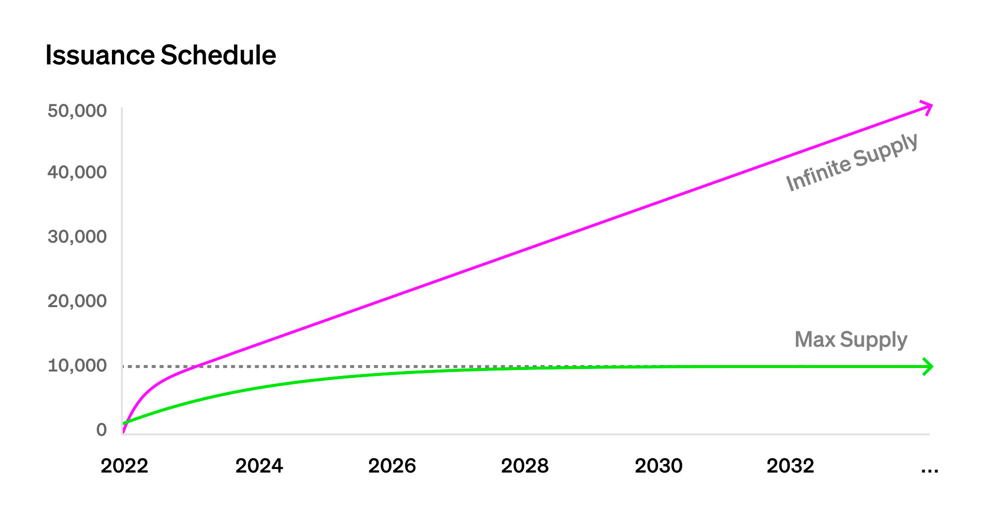
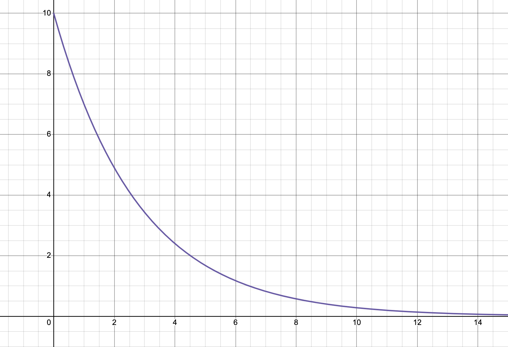
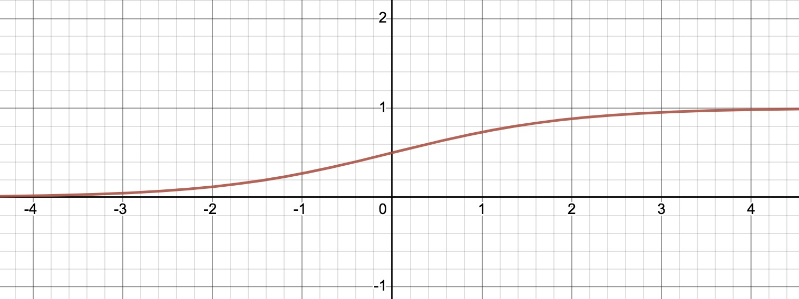
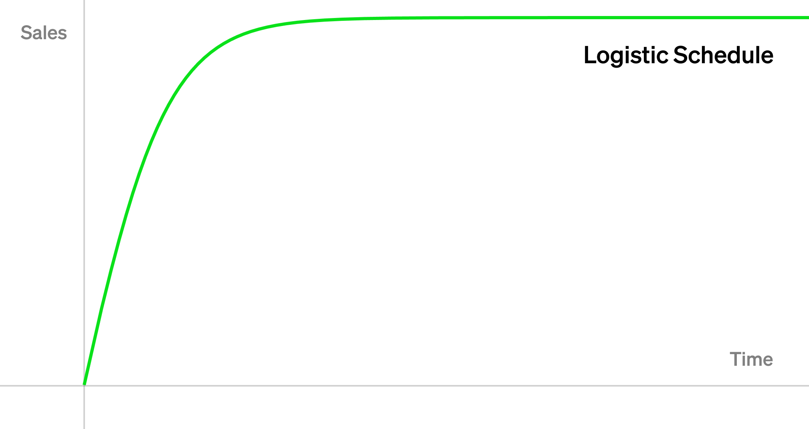

[English](./README.md) | [中文](./README_zh.md)

# VRGDA Algorithm Analysis

> This article is a simple compilation of Paradigm's blog [VRGDA](https://www.paradigm.xyz/2022/08/vrgda). For more details, please read the original text.

## Overview

[VRGDA](https://www.paradigm.xyz/2022/08/vrgda), short for Variable Rate Gradual Dutch Auctions, is a token issuance mechanism proposed by Paradigm. Its purpose is to achieve the effect of gradual Dutch auctions through a customizable token issuance model: when the market demand exceeds expectations, the price rises; conversely, when the market demand is below expectations, the price drops; and when the market demand meets expectations, the price equals the set target price.

In the [Art Gobblers](https://artgobblers.com/) project, two types of NFTs are auctioned using VRGDA: Gobbler, with a fixed upper limit of 10,000, and Page, with no upper limit. The issuance rates of these two tokens are shown in the figure below:



## Definition

### Function

To achieve the effect of Dutch auctions, a function of price $p$ and time $t$ needs to be found, so that the price $p$ shows a downward trend as time $t$ increases.

Many functions can meet the requirements, as mentioned in the [GDA article](https://www.paradigm.xyz/2022/04/gda) by Paradigm:

$$
p_n(t) = k \cdot \alpha^n e^{-\lambda t} \quad \text{(1)}
$$

Here, we choose the following function:

$$
p_n(t) = p_0 \cdot c^t \text{, 0 < c < 1} \quad \text{(2)}
$$

Where $p_0$ is the initial price, and since $0 \lt c \lt 1$, the price $p_n$ will be less than $p_0$ as time $t$ increases.

Assume $c = 0.7$, and the time unit of $t$ is days, which means the price decreases to 70% of the previous day’s price each day.

The curve of price (vertical axis) vs. time (horizontal axis) is shown in the figure below:



### Parameters

Define the following parameters:

* $p_0$ - Target price. If the NFTs are auctioned at the planned speed, which means market demand meets expectations, each NFT will be sold at this price.
* $k$ - If no NFTs are sold within the unit time, the NFT price decreases by this percentage.
* $f(t)$ - Token issuance model, indicating the expected number of NFTs to be issued within time $t$.

We use $1-k$ to replace $c$ in equation (1):

$$
p_n(t) = p_0 \cdot (1-k)^t \quad \text{(3)}
$$

Assume $k=0.30$, the time unit of $t$ is days, and the initial price is $p_0$, then it means if there is no transaction, the price decreases by 30% each day (70% of the previous day's price).

### Token Model

So far, equation (3) has achieved the effect of price decreasing with time.

To reflect market demand in the price, we use $t - s_n$ to replace $t$, where $s_n$ is a function defined by the number of tokens auctioned $n$.

We hope $s_n$ can achieve the following effects:

1. If the auction progress is faster than expected, the starting price of the next NFT is greater than $p_0$.
2. If the auction progress is slower than expected, the starting price of the next NFT is less than $p_0$.
3. If the auction progress matches the expectations, the starting price of the next NFT equals $p_0$.

Assume the auction progress matches the expectations, we can derive:

$$
p_0 \cdot (1-k)^{t_n - s_n} = p_0 \quad \text{(4)}
$$

Thus $t_n = s_n$, so $s_n$ can be seen as a function of time and token quantity, i.e., the inverse function of the token quantity and time function $f(t)$:

$$
s_n = t_n = f^{-1}(n) \quad \text{(5)}
$$

Where the token quantity and time function $f(t)$ is the token issuance model.

Since $0 \lt (1-k) \lt 1$, if the auction progress is faster than expected, then $t < s_n$, i.e., $t - s_n < 0$, thus $(1-k)^{t - s_n} \gt 1$, and it is known: $p_n \gt p_0$, i.e., the starting price is greater than $p_0$; similarly, if the auction progress is slower than expected, then $p_n \lt p_0$, i.e., the starting price is less than $p_0$.

Especially, when the market is overheated, the auction price will rise rapidly to reduce market enthusiasm and prevent whales from auctioning in bulk.

This achieves the interaction between auction price and market enthusiasm.

### VRGDA Formula

The final formula of VRGDA is as follows:

$$
vrgda_n(t) = p_0(1-k)^{t - f^{-1}(n)} \quad \text{(6)}
$$

Where,

* $p_0$ - Target price.
* $k$ - Percentage of price decay per unit time.
* $f^{-1}(n)$ - Function of time and token quantity, i.e., the inverse function of the token issuance model $f(t)$.
* $t$ - Time from the start of the auction to the present.

## Common Token Issuance Models

Next, we will introduce the VRGDA algorithm with several common token issuance models.

### Linear

Assume the expected number of NFTs sold per day is $r$, then the function of token quantity and time (issuance model) is:

$$
f(t) = rt
$$

The corresponding curve is:


Its inverse function (function of time and token quantity) is:

$$
f^{-1}(n) = \frac{n}{r}
$$

Substitute into formula (6), the VRGDA formula for the linear issuance rate is:

$$
{linearvrgda}_n(t) = p_0(1-k)^{t - \frac{n}{r}} \quad \text{(7)}
$$

### Square Root

Assume the expected time for the 1st NFT is the 1st day, the 2nd NFT on the 4th day, and the $n$-th NFT on the $n^2$ day, i.e., the function of token quantity and time is:

$$
f(t) = \sqrt{t}
$$

The corresponding curve is:


Its inverse function is:

$$
f^{-1}(n) = n^2
$$

Substitute into formula (6):

$$
{sqrtvrgda}_n(t) = p_0(1-k)^{t - n^2} \quad \text{(8)}
$$

### Logistic Function

The logistic function ([Logistic Function](https://en.wikipedia.org/wiki/Logistic_function)) is an S-shaped function, simplified as:

$$
l(t) = \frac{1}{1 + e^{-t}}
$$

It can compress any input into the range of $(0,1)$, as shown in the figure:



We can use the logistic function as an issuance model with an upper limit.

First, shift the function downward along the vertical axis by 0.5 (since $l(t)=0.5$ when $t=0$), take $t \gt 0$, then $0 \lt l(t) \lt 0.5$, and the function is:

$$
l(t) = \frac{1}{1 + e^{-t}} - 0.5 \text{, t > 0}
$$

Assume we want the total number of tokens to be $L - 1$, we can scale the above formula by $2L$ and introduce a time multiplier $s$ to control the issuance rate, resulting in the issuance function:

$$
f(t) = \frac{2L}{1 + e^{-st}} - L \text{, t > 0}
$$

When $t = \frac{1}{s}$, we get:

$$
\frac{f(\frac{1}{s})}{L} = \frac{2}{1 + e^{-1}} - 1 \approx 0.46
$$

Therefore, $s$ can be chosen to achieve 46% of the total token issuance at the desired time. For example, if we want 46% of the total issuance after 100 days, then $\frac{1}{s} = 100$, thus $s = \frac{1}{100} = 0.01$.

The inverse function of $f(t)$ is:

$$
f^{-1}(n) = -\frac{ln(\frac{2L}{L + n} - 1)}{s}
$$

Substitute into formula (6), the VRGDA formula based on the logistic function is:

$$
logisticvrgda_n(t) = p_0(1-k)^{t + \frac{ln(\frac{2L}{L + n} - 1)}{s}} \quad \text{(9)}
$$

The corresponding token issuance curve is shown below:



## VRGDA in Art Gobblers

In the Art Gobblers project, Gobbler and Page NFTs are auctioned using VRGDA, where:

* Gobbler uses the logistic function as the issuance model, with a fixed upper limit of 10,000.
* Page uses a combination of logistic and linear issuance models, switching to linear issuance after a certain period, with no upper limit.

Taking Gobbler as an example, let’s see how the VRGDA auction parameters are defined in the [source code](https://github.com/artgobblers/art-gobblers):

```solidity
constructor(
    // Mint config:
    bytes32 _merkleRoot,
    uint256 _mintStart,
    // Addresses:
    Goo _goo,
    Pages _pages,
    address _team,
    address _community,
    RandProvider _randProvider,
    // URIs:
    string memory _baseUri,
    string memory _unrevealedUri
)
    GobblersERC721("Art Gobblers", "GOBBLER")
    Owned(msg.sender)
    LogisticVRGDA(
        69.42e18, // Target price.
        0.31e18, // Price decay percent.
        // Max gobblers mintable via VRGDA.
        toWadUnsafe(MAX_MINTABLE),
        0.0023e18 // Time scale.
    )
```

Here, focus on the last few lines:

* 69.42e18: Target price (initial price) $p_0$.
* 0.31e18: Indicates that if no auction is successful within a day, the price becomes $1-0.31=69%$ of the previous day’s price.
* MAX_MINTABLE: Maximum number of tokens that can be auctioned, i.e., $L - 1$ (note, not $L$).
* 0.0023e18: Time multiplier $s$, $\frac{1}{0.0023} \approx 435$ indicates that it is expected to auction 46% of the total tokens in 435 days, according to [the Gobbler auction plan](https://docs.google.com/spreadsheets/d/1i8hYuWyAymjbwx54fA1HcEMEwfEEyluX4tPssOXoyf4/edit#gid=1608966566), reaching 46% of the auction volume around the 15th month (approximately 435 days).

## Summary

VRGDA proposes a customizable gradual Dutch auction method for token models, allowing the market to participate in the pricing of auctioned tokens. In fact, this algorithm can be applied not only to NFT auctions but also to ERC20 token auctions. The essence of the VRGDA algorithm is an AMM that dynamically adjusts market prices through algorithms.

## References

* Variable Rate GDAs: https://www.paradigm.xyz/2022/08/vrgda
* Gradual Dutch Auctions: https://www.paradigm.xyz/2022/04/gda
* Art Gobblers: https://www.paradigm.xyz/2022/09/artgobblers